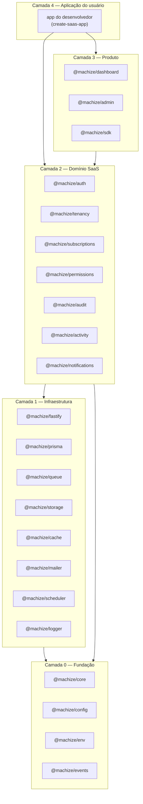
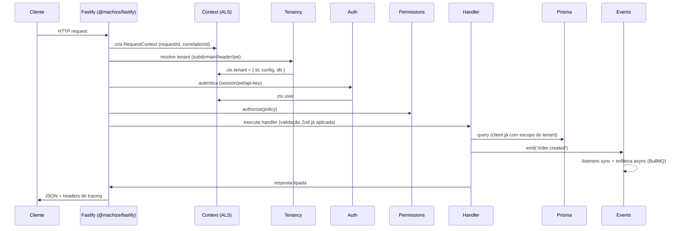
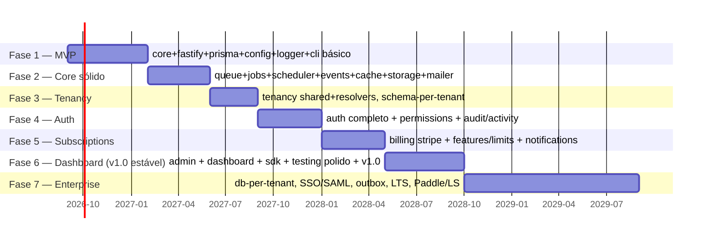

# RFC-0001 — Machize: O Ecossistema Laravel para Node.js SaaS

| Campo | Valor |
|---|---|
| **Status** | Draft |
| **Autor** | Machize Core Team |
| **Criado em** | 2026-08-05 |
| **Escopo npm** | `@machize/*` |
| **Licença** | MIT |
| **Stack** | Node.js 22+, TypeScript 5.x, Fastify 5, Prisma, PostgreSQL, Redis, MinIO, BullMQ, Zod, Vitest, TurboRepo, pnpm, Changesets |

---

## 1. Visão e Filosofia

**Machize** é um ecossistema open source de bibliotecas altamente integradas para construir aplicações SaaS em Node.js. O objetivo não é criar "mais um framework HTTP" — Fastify já resolve isso. O objetivo é resolver **a camada que falta**: tudo que fica entre o servidor HTTP e o produto SaaS pronto — tenancy, billing, auth, permissões, auditoria, filas, notificações — com a coesão e a elegância que o Laravel entrega ao PHP.

### 1.1 Princípios

1. **Convenção acima de configuração** — um app Machize funciona com zero config; tudo é sobrescrevível.
2. **Fastify-first, não Fastify-locked** — o core é agnóstico de HTTP; `@machize/fastify` é o adaptador oficial. Isso protege o ecossistema contra a obsolescência de qualquer servidor HTTP.
3. **TypeScript como linguagem de design** — inferência de tipos de ponta a ponta (rotas → validação Zod → handler → cliente SDK). Nada de decorators experimentais nem `reflect-metadata` como dependência obrigatória.
4. **Progressive disclosure** — API simples para o caso comum, escape hatches para o caso avançado. `auth.login(email, senha)` funciona; por baixo, cada passo é um hook substituível.
5. **Tenancy como cidadão de primeira classe** — diferente do Laravel (onde tenancy é pacote de terceiro), no Machize o contexto de tenant permeia cache, storage, queue, logger e Prisma nativamente via `AsyncLocalStorage`.
6. **Tudo testável** — cada pacote embarca fakes/drivers de memória (`@machize/testing`), no espírito de `Mail::fake()` do Laravel.
7. **Documentação é produto** — nenhuma feature entra sem docs, exemplo executável e receita no cookbook.

### 1.2 Anti-objetivos

- Não reimplementar ORM (Prisma), servidor HTTP (Fastify), validação (Zod) ou fila (BullMQ). Machize **integra e orquestra**, não reinventa.
- Não usar decorators + `reflect-metadata` como mecanismo central de DI (o erro estrutural do NestJS que quebra com ESM/esbuild/Bun e esconde o grafo de dependências).
- Não acoplar a um frontend específico. O dashboard é opcional e desacoplado via SDK.

---

## 2. Arquitetura Geral

### 2.1 Camadas



**Regra de dependência (invariante arquitetural):** um pacote só pode depender de pacotes de camadas **inferiores**. Pacotes da mesma camada nunca se importam diretamente — comunicam-se via **eventos** e **contratos** definidos no `@machize/core`. Isso é verificado no CI com `dependency-cruiser`.

**Por quê:** é o que impede o "big ball of mud". `subscriptions` não importa `tenancy`; ele consome a interface `TenantContext` exportada pelo core. Qualquer pacote de domínio pode ser usado isoladamente num app Fastify existente — adoção incremental é a principal estratégia de crescimento (ver §21).

### 2.2 Estrutura do Monorepo

```
machize/
├── packages/
│   ├── core/               # DI, plugins, lifecycle, context, hooks
│   ├── config/             # Sistema de configuração tipada
│   ├── env/                # Validação de env vars com Zod
│   ├── events/             # Event bus (sync/async/queued)
│   ├── logger/             # Logger estruturado (Pino-based)
│   ├── fastify/            # Adaptador HTTP + roteamento tipado
│   ├── prisma/             # Extensões Prisma (tenancy, audit, soft-delete)
│   ├── cache/              # Cache multi-driver com tags
│   ├── queue/              # BullMQ com DX Laravel-like
│   ├── jobs/               # Definição declarativa de jobs
│   ├── scheduler/          # Cron fluente
│   ├── storage/            # Abstração de object storage
│   ├── mailer/             # E-mails com templates
│   ├── auth/               # Autenticação completa
│   ├── tenancy/            # Multi-tenancy (inspirado em Stancl)
│   ├── permissions/        # RBAC/ABAC (inspirado em Spatie)
│   ├── subscriptions/      # Billing (inspirado em Cashier)
│   ├── audit/              # Trilha de auditoria automática
│   ├── activity/           # Activity log (inspirado em Spatie)
│   ├── notifications/      # Notificações multicanal
│   ├── cli/                # CLI "mach" (inspirado no Artisan)
│   ├── create-app/         # npx create-saas-app
│   ├── generator/          # Scaffolding de código
│   ├── testing/            # Fakes, helpers, factories
│   ├── sdk/                # Cliente TypeScript type-safe
│   ├── dashboard/          # Dashboard administrativo
│   └── admin/              # Componentes de admin reutilizáveis
├── apps/
│   ├── docs/               # Site de documentação (machize.dev)
│   ├── playground/         # App de referência usado nos testes E2E
│   └── examples/           # Exemplos oficiais (starter kits)
├── tooling/
│   ├── tsconfig/           # tsconfigs compartilhados
│   ├── eslint-config/      # Regras de lint compartilhadas
│   └── vitest-config/      # Presets de teste
├── .changeset/
├── turbo.json
├── pnpm-workspace.yaml
└── package.json
```

### 2.3 Convenções de pacote

Todo pacote segue o mesmo contrato estrutural:

```
packages/<nome>/
├── src/
│   ├── index.ts            # API pública — ÚNICO entrypoint exportado
│   ├── plugin.ts           # machizePlugin() — integração com o core
│   ├── contracts/          # Interfaces públicas
│   ├── drivers/            # Implementações substituíveis
│   ├── errors.ts           # Erros tipados do pacote
│   └── testing.ts          # Fakes (exportado como subpath ./testing)
├── package.json            # exports map: ".", "./testing", "./plugin"
├── CHANGELOG.md            # gerado pelo Changesets
└── README.md               # espelho da doc do pacote
```

- **ESM only**, `"type": "module"`, build com `tsup` (dual export apenas onde houver demanda real).
- **`exports` map estrito** — nada de deep imports; a API pública é o que está em `index.ts`. Isso permite refatoração interna sem breaking change.
- Erros sempre estendem `MachizeError` com `code` estável (ex.: `TENANCY_NOT_RESOLVED`), documentado — códigos de erro fazem parte do contrato semver.
- Todo driver implementa uma interface de `contracts/` e é registrado no DI — trocar Redis por memória é 1 linha de config.

### 2.4 Publicação, versionamento e manutenção

| Decisão | Escolha | Justificativa |
|---|---|---|
| Versionamento | **Fixed/locked** entre pacotes core (todos sobem juntos, como Babel/Jest) | Elimina matriz de compatibilidade; `@machize/auth@1.4` sempre funciona com `@machize/core@1.4`. Pacotes satélites (sdk, dashboard) podem versionar independente. |
| Releases | Changesets + GitHub Actions; canal `latest`, `next` (pre-releases) e `canary` (todo merge na main) | Feedback rápido da comunidade sem comprometer estabilidade |
| Semver | Estrito. Breaking = major. Códigos de erro, eventos públicos e nomes de config são API | Confiança é o ativo nº 1 de um framework |
| LTS | A cada major, a anterior recebe 12 meses de security fixes | Requisito para adoção enterprise |
| Suporte Node | Últimas 2 LTS ativas | Equilíbrio entre modernidade e alcance |
| Manutenção | CODEOWNERS por pacote; issues triadas com labels por pacote; bot de reprodução mínima (StackBlitz template) | Escala o time de mantenedores horizontalmente |

### 2.5 Fluxo interno de uma request



O ponto central: **`AsyncLocalStorage` carrega o contexto** (request, tenant, user, correlation id) por toda a call stack — handlers, services, jobs, listeners — sem passar parâmetros manualmente. É o equivalente do "container por request" do Laravel, mas nativo do Node.

---

## 3. `@machize/core` — A Fundação

### 3.1 Responsabilidades

| Subsistema | O que faz |
|---|---|
| **DI Container** | Registro/resolução de serviços, escopos (singleton, request, transient), injeção por token tipado |
| **Plugin System** | Unidade de composição do ecossistema; todo pacote é um plugin |
| **Context (ALS)** | `AsyncLocalStorage` tipado e extensível |
| **Lifecycle** | Fases: `configuring → registering → booting → ready → shutting-down` |
| **Hooks** | Pontos de extensão nomeados com prioridade |
| **Event Bus** | Re-export de `@machize/events` ligado ao container |
| **Discovery** | Auto-descoberta de jobs, listeners, policies e comandos por convenção de arquivos |
| **Metadata** | Registro central do que cada plugin declarou (rotas, jobs, schemas) — alimenta CLI, docs e dashboard |

### 3.2 Decisão: DI sem decorators

O container usa **tokens tipados + funções factory**, não decorators:

```ts
import { createToken, type Container } from '@machize/core'

// contrato
export interface Mailer { send(msg: Message): Promise<void> }
export const MAILER = createToken<Mailer>('mailer')

// registro (dentro de um plugin)
container.singleton(MAILER, (c) => new SmtpMailer(c.get(CONFIG).mail))

// resolução — totalmente tipada, sem reflect-metadata
const mailer = container.get(MAILER)
```

**Por quê:** funciona em qualquer bundler/runtime (esbuild, Bun, Deno, edge), o grafo de dependências é explícito e navegável pelo "go to definition", e tree-shaking funciona. Decorators legacy + `emitDecoratorMetadata` é a maior dívida técnica do NestJS.

### 3.3 Plugin System

```ts
import { definePlugin } from '@machize/core'

export const cachePlugin = definePlugin({
  name: 'machize:cache',
  dependsOn: ['machize:config'],
  configSchema: z.object({
    driver: z.enum(['redis', 'memory']).default('redis'),
    prefix: z.string().default('mach'),
  }),
  register({ container, config }) {
    container.singleton(CACHE, () => createCacheDriver(config))
  },
  boot({ hooks }) {
    hooks.on('tenancy:switched', ({ tenant }) => { /* troca prefixo */ })
  },
  shutdown({ container }) {
    return container.get(CACHE).disconnect()
  },
})
```

- `dependsOn` gera ordenação topológica de boot; ciclos são erro de inicialização com mensagem explicando o ciclo.
- `configSchema` (Zod) valida config no boot — **fail fast** com mensagem apontando a chave errada.
- Hooks de outros pacotes (como `tenancy:switched`) são tipados via **module augmentation** — cada pacote aumenta a interface global `MachizeHooks`.

### 3.4 Application e Context

```ts
import { createApp } from '@machize/core'

const app = createApp({
  plugins: [configPlugin, prismaPlugin, tenancyPlugin, authPlugin],
})

await app.boot()

// Contexto — acessível em QUALQUER ponto da call stack
import { ctx } from '@machize/core'

export async function anyService() {
  const { tenant, user, requestId, logger } = ctx()
  logger.info('processando') // já sai com tenantId + requestId + traceId
}
```

`ctx()` fora de um escopo ativo lança `ContextUnavailableError` com dica de correção (rodar dentro de `app.runWithContext()`), exceto os campos com fallback seguro (logger).

### 3.5 API pública (resumo)

```ts
export {
  createApp, definePlugin, createToken, ctx,
  type Container, type MachizeApp, type MachizePlugin,
  type MachizeHooks, type RequestContext,
  MachizeError, onShutdown, onBoot,
}
```

**Roadmap do core:** v1 — container, plugins, ALS, hooks; v1.x — discovery com watch mode, devtools de inspeção do grafo DI; v2 — suporte a workers threads com contexto propagado.

---
## 4. Camada HTTP — Core independente de framework

### 4.1 Decisão arquitetural

O Machize **não é uma biblioteca para Fastify** — é um ecossistema com core independente de framework HTTP. A camada de domínio (auth, tenancy, subscriptions…) fala apenas com contratos do core; quem traduz HTTP ⇄ contexto é um **adaptador**:


```ts
// @machize/core/contracts/http.ts
export interface HttpAdapter {
  register(route: RouteDefinition): void
  use(mw: MachizeMiddleware): void
  listen(opts: ListenOptions): Promise<void>
  close(): Promise<void>
}

export interface MachizeRequest {           // shape neutro, não o Request do Fastify
  method: string; url: string
  headers: Headers; params: Record<string, string>
  query: unknown; body: unknown
  raw: unknown                              // escape hatch para o objeto nativo
}
```

**Consequências:**
- Pacotes de domínio expõem middlewares/guards como funções puras sobre `MachizeRequest` + `ctx()` — nunca importam Fastify.
- O adaptador Fastify é a **implementação de referência** e a única com garantia de suporte tier-1 no v1. Outros adaptadores seguem uma **suíte de conformidade** publicada em `@machize/testing/adapter-compliance` (mesmo modelo dos testes de conformidade de drivers do Laravel).
- Isso torna o Machize resiliente a mudanças de moda no HTTP layer (Express → Fastify → Hono → o que vier) sem reescrever o domínio.

### 4.2 `@machize/fastify` — Adaptador oficial

**Objetivo:** roteamento tipado de ponta a ponta com validação Zod, aproveitando a performance e o ecossistema de plugins do Fastify.

```ts
import { route } from '@machize/fastify'
import { z } from 'zod'

export const createProject = route({
  method: 'POST',
  url: '/projects',
  auth: true,                        // exige usuário autenticado
  can: 'projects:create',            // permissão (→ @machize/permissions)
  body: z.object({ name: z.string().min(3) }),
  response: { 201: ProjectSchema },
  async handler({ body, reply }) {
    const project = await ctx().db.project.create({ data: body })
    return reply.code(201).send(project)
  },
})
```

- Tipos do `body`/`query`/`params`/`response` **inferidos do Zod** — o handler é 100% tipado e o mesmo schema alimenta OpenAPI (gerado automaticamente) e o `@machize/sdk`.
- `auth`, `can`, `tenant` são **shorthands declarativos** que os plugins de domínio registram no adaptador via hooks — o adaptador não conhece auth; ele só executa a cadeia de guards registrada.
- Discovery: arquivos em `src/routes/**/*.ts` que exportam `route()` são registrados automaticamente (convenção; desligável).

**Dependências:** `fastify`, `@machize/core`, `zod`. **Roadmap:** v1 rotas + OpenAPI; v1.x rate-limit por tenant, ETags; v2 streaming/SSE tipado.

## 5. `@machize/prisma` — Camada de dados

**Objetivo:** fazer o Prisma "falar Machize": tenancy, auditoria e convenções sem alterar o workflow padrão do Prisma.

- **Client extensions** (não fork): `withTenancy()`, `withAudit()`, `withSoftDelete()` são Prisma Client Extensions oficiais.
- O client correto do tenant é acessado por `ctx().db` — resolvido pelo modo de tenancy ativo (§6).
- **Connection pool management** para database-per-tenant: LRU de clients com limite configurável e desconexão idle (problema real que o Stancl resolve no PHP e ninguém resolve bem no Node).
- Migrations por tenant orquestradas pelo CLI (`mach tenant migrate`), com paralelismo e relatório de falhas por tenant.

```ts
// ctx().db é um PrismaClient já escopado ao tenant atual
const users = await ctx().db.user.findMany() // WHERE tenant_id = ... automático (modo shared)
```

**Dependências:** `@prisma/client`, `@machize/core`. **Roadmap:** v1 extensions + pool; v1.x read replicas; v2 sharding helpers.

---

## 6. `@machize/tenancy` — Multi-tenancy (inspirado no Stancl)

### 6.1 Modos de isolamento

| Modo | Como funciona | Quando usar |
|---|---|---|
| **Shared Database** | Coluna `tenantId` + filtro automático via Prisma extension | default; menor custo operacional |
| **Schema per Tenant** | `SET search_path` por request (PostgreSQL schemas) | isolamento médio, um só banco |
| **Database per Tenant** | Client Prisma por tenant com pool LRU | isolamento máximo, compliance |

O modo é config, não código: o app escreve `ctx().db.user.findMany()` igual nos três modos. Migrar de shared → database-per-tenant é uma migração de dados, não uma reescrita.

### 6.2 Resolvers

```ts
tenancyPlugin({
  mode: 'shared',
  resolvers: [
    subdomainResolver({ base: 'machize.app' }),   // acme.machize.app
    domainResolver(),                              // app.acme.com (domínio customizado)
    headerResolver({ header: 'x-tenant-id' }),
    jwtResolver({ claim: 'tid' }),
    routeResolver({ param: 'tenant' }),            // /t/:tenant/...
  ],
  // custom resolver = função async (req) => tenantId | null
})
```

Resolvers rodam em ordem; o primeiro que resolve vence. Falha em resolver → `TENANCY_NOT_RESOLVED` (404 ou fallback para "central app", configurável — mesmo conceito de rotas centrais vs. rotas de tenant do Stancl).

### 6.3 Contexto e integrações automáticas

Quando o tenant é resolvido, o plugin dispara o hook `tenancy:switched`, e cada pacote de infraestrutura se ajusta sozinho:

| Pacote | Efeito automático |
|---|---|
| cache | prefixo `tenant:{id}:` em todas as chaves |
| storage | pasta/bucket raiz por tenant |
| queue | `tenantId` serializado no payload do job; restaurado no worker via ALS |
| logger | campo `tenantId` em todo log |
| config | overrides por tenant (`ctx().tenant.config.get('branding.logo')`) |
| mailer | remetente/branding por tenant |

```ts
// API programática
import { tenancy } from '@machize/tenancy'

await tenancy.create({ id: 'acme', name: 'Acme Inc' })   // roda migrations + seed
await tenancy.run('acme', async () => { /* código no contexto do tenant */ })
await tenancy.forEach(async (t) => { /* manutenção em massa */ }, { concurrency: 5 })
```

**Eventos:** `tenant.created`, `tenant.deleted`, `tenant.migrated`, `tenant.switched`. **CLI:** `mach tenant create|migrate|seed|run|list`. **Roadmap:** v1 shared + resolvers; v1.x schema-per-tenant, seeder; v2 database-per-tenant com pool LRU, domínios customizados com provisionamento de TLS.

---

## 7. `@machize/auth` — Autenticação

**Objetivo:** auth completa server-side, com dados no **seu** banco (Prisma), sem vendor lock-in — o posicionamento do Laravel Fortify/Sanctum contra Auth0/Clerk.

```ts
authPlugin({
  strategies: {
    session: { store: 'redis', ttl: '30d', rolling: true },
    jwt: { access: '15m', refresh: '30d', rotation: true },   // refresh rotation + reuse detection
    apiKey: { hash: 'sha256', prefix: 'mk_' },
  },
  mfa: { totp: true, recoveryCodes: 10 },
  oauth: {
    google: { clientId: env.GOOGLE_ID, clientSecret: env.GOOGLE_SECRET },
    github: { ... },   // providers via driver interface — comunidade adiciona os demais
  },
  passwordReset: { ttl: '1h' },
  emailVerification: { required: true },
})
```

Fluxos prontos (rotas registradas automaticamente, todas sobrescrevíveis):
`POST /auth/register · /auth/login · /auth/logout · /auth/refresh · /auth/password/forgot · /auth/password/reset · /auth/verify-email · /auth/mfa/enroll · /auth/mfa/verify · GET /auth/oauth/:provider · /auth/oauth/:provider/callback`

- Senhas com **argon2id**; refresh tokens com **rotação + detecção de reuso** (revoga a família toda); API keys com hash + prefixo identificável em secret scanning.
- Cada passo emite eventos (`auth.login`, `auth.login_failed`, `auth.mfa_enabled`…) — consumidos por audit, notifications e rate limiting.
- Multi-tenant nativo: usuário pode ser central (um login, N tenants) ou por tenant — decisão de config, integrada ao `@machize/tenancy`.

**Roadmap:** v1 session + JWT + reset + verificação; v1.x API keys, TOTP, OAuth (Google/GitHub); v2 WebAuthn/Passkeys, SSO SAML/OIDC (enterprise).

---

## 8. `@machize/permissions` — Autorização (inspirado no Spatie)

```ts
// RBAC estilo Spatie
await user.assignRole('admin')
await role.givePermissionTo('projects:delete')
await user.can('projects:delete')            // via role ou permissão direta

// Policies (ABAC) — para regras com contexto
export const ProjectPolicy = definePolicy('project', {
  update: (user, project) => project.ownerId === user.id || user.can('projects:manage'),
  delete: (user, project) => user.hasRole('admin'),
})

// No route handler (integra com o shorthand `can` do §4.2)
can: 'project:update'        // resolve a policy com o recurso carregado
```

- **Escopo por tenant**: roles/permissions pertencem ao tenant atual por padrão; roles globais são explícitas (`{ scope: 'global' }`). Resolve o problema nº 1 de usar Spatie em SaaS multi-tenant.
- **Super Admin**: `superAdmin: (user) => user.isOwner` — curto-circuita todos os checks via hook `Gate::before` (mesmo padrão do Laravel).
- Cache de permissões em `@machize/cache` com invalidação por evento (`permission.changed`) — checks são O(1) em memória por request.
- Guards por estratégia de auth: uma permissão pode valer para session mas não para API key (escopos de API key).

**Roadmap:** v1 roles/permissions/policies + tenant scope; v1.x sync UI no dashboard, wildcard permissions (`projects:*`); v2 permissões temporárias e delegação.

---
## 9. `@machize/subscriptions` — Billing (inspirado em Cashier + Soulbscription)

**Objetivo:** modelo de billing próprio no seu banco, com gateways como drivers — o app fala com o Machize, nunca direto com Stripe.

```ts
subscriptionsPlugin({
  gateway: stripeDriver({ secret: env.STRIPE_SECRET }),   // paddleDriver | lemonSqueezyDriver
  plans: definePlans({
    free:  { price: 0, features: { projects: 3, seats: 1, api: false } },
    pro:   { price: { monthly: 29, yearly: 290 }, trial: '14d',
             features: { projects: 50, seats: 10, api: true, 'api.requests': meter(100_000) } },
    scale: { price: 'custom', features: { projects: Infinity, seats: Infinity, api: true } },
  }),
})
```

```ts
// API fluente no tenant (billable = tenant por padrão; configurável para user)
await tenant.subscribe('pro', { period: 'monthly' })
await tenant.subscription.swap('scale')                  // com proration
await tenant.subscription.cancel({ atPeriodEnd: true })

// Feature flags + limites — o coração do modelo Soulbscription
await tenant.features.can('api')                         // boolean flag
await tenant.features.remaining('projects')              // 47
await tenant.features.consume('api.requests', 1)         // metered; lança QuotaExceededError
```

- **Webhooks**: endpoint único `/billing/webhook/:gateway` com verificação de assinatura, idempotência (dedupe por event id em Redis) e tradução para **eventos de domínio** (`subscription.created`, `subscription.past_due`, `invoice.paid`) — o app nunca trata payload cru do gateway.
- **Sincronização eventual**: estado local é a verdade para leitura (checks de feature são O(1), sem chamada ao gateway); webhooks + reconcile job noturno mantêm consistência.
- Cupons, invoices (PDF via job), grace period para pagamento falho, trial sem cartão.
- Middleware/guard: `subscribed('pro')`, `feature('api')` como shorthands de rota.

**Roadmap:** v1 Stripe + planos/trials/feature flags; v1.x metered billing, cupons, invoices; v2 Paddle + Lemon Squeezy, tax/invoicing internacional.

## 10. `@machize/audit` + `@machize/activity`

**Audit** (compliance — imutável, automático):
- Prisma extension registra todo CUD: quem (`ctx().user`), em qual tenant, o quê (diff before/after), quando, de onde (ip/userAgent do contexto).
- Assina eventos de outros pacotes: `auth.login/logout`, `permission.changed`, `subscription.*`, `tenant.*` — cobertura automática dos fluxos sensíveis.
- Append-only: sem API de update/delete; retenção e exportação (S3) configuráveis.

**Activity** (produto — feed "fulano fez X", estilo Spatie Activitylog):
```ts
await activity('project')
  .performedOn(project)
  .withProperties({ from: 'draft', to: 'published' })
  .log('published')

const feed = await activity.for(project).latest(20)
```
Distinção deliberada: audit é para o auditor (imutável, verboso), activity é para o usuário final (curado, legível). O Laravel mistura os dois no Activitylog; separar evita retenção/permissão conflitantes.

## 11. `@machize/notifications` — Multicanal

```ts
export const InvoicePaid = defineNotification({
  name: 'invoice.paid',
  channels: (user) => ['mail', 'inApp', user.prefs.sms && 'sms'].filter(Boolean),
  via: {
    mail:  (n) => mailTemplate('invoice-paid', { invoice: n.invoice }),
    inApp: (n) => ({ title: 'Fatura paga', body: `Fatura #${n.invoice.number} confirmada` }),
    sms:   (n) => `Machize: fatura #${n.invoice.number} paga.`,
  },
})

await notify(user, InvoicePaid, { invoice })
await notifyMany(tenant.admins(), InvoicePaid, { invoice })
```

- Canais como drivers: `mail` (via `@machize/mailer`), `sms` (Twilio driver), `push` (FCM/APNs via web push), `whatsapp` (Cloud API driver), `inApp` (tabela + SSE/websocket para o dashboard).
- Envio **sempre via queue** por padrão (retry/backoff do BullMQ); síncrono opt-in.
- Preferências por usuário (opt-out por canal/categoria) embutidas; templates versionados com preview no dashboard.

**Roadmap:** v1 mail + inApp; v1.x push + sms + preferências; v2 whatsapp, digest/batching ("5 novos comentários" em 1 e-mail).

## 12. Infraestrutura

### 12.1 `@machize/storage`
```ts
await storage.disk('uploads').put('avatar.png', buffer)        // tenant-prefixed automático
const url = await storage.disk('uploads').temporaryUrl('avatar.png', '15m')  // signed URL
await storage.disk('uploads').image('avatar.png').resize(256).webp().save('avatar-sm.webp')
```
Drivers: MinIO/S3 (mesmo driver, S3-compatible), Local, Azure Blob, GCS — todos passando na mesma suíte de conformidade. Isolamento por tenant via prefixo (default) ou bucket dedicado (config). Image processing via `sharp` em job (não bloqueia request). Upload direto browser→storage com URLs pré-assinadas geradas pelo backend.

### 12.2 `@machize/queue` + `@machize/jobs`
```ts
export const SendWelcomeEmail = defineJob({
  name: 'email.welcome',
  schema: z.object({ userId: z.string() }),        // payload validado no dispatch E no worker
  attempts: 3, backoff: { type: 'exponential', delay: '30s' },
  async handle({ userId }) {
    const { db, logger } = ctx()                   // tenant restaurado automaticamente!
    ...
  },
})

await SendWelcomeEmail.dispatch({ userId }, { delay: '5m', priority: 2 })
```
BullMQ por baixo; o Machize adiciona: payload tipado/validado, **propagação de contexto** (tenant/correlationId serializados e restaurados no worker via ALS), DLQ com replay pelo dashboard/CLI, workers com graceful shutdown ligado ao lifecycle do core. `mach queue work`, `mach queue retry --failed`, `mach queue stats`.

### 12.3 `@machize/scheduler`
```ts
schedule.job(ReconcileBilling).daily().at('03:00').timezone('UTC')
schedule.command('tenant:cleanup').weekly().sundays()
schedule.call(() => cache.purgeExpired()).everyMinute().withoutOverlapping()
schedule.job(SendDigest).monthly().onFailure(notifyOps)
```
Implementado sobre BullMQ repeatable jobs (sem daemon próprio — sobrevive a restarts, roda em cluster sem duplicar via lock distribuído). `withoutOverlapping()`, `onOneServer()`, janela de manutenção, e `mach schedule list` mostrando próximas execuções.

### 12.4 `@machize/events`
```ts
export const OrderCreated = defineEvent('order.created', z.object({ orderId: z.string() }))

on(OrderCreated, async ({ orderId }) => { ... })                    // sync (mesma transação lógica)
on(OrderCreated, { queued: true }, async ({ orderId }) => { ... })  // vira job automaticamente
on('order.*', auditListener)                                         // wildcard
```
Eventos tipados (payload Zod), listeners sync ou enfileirados (a ponte events→queue é automática), wildcards para cross-cutting (audit assina `*`). **Domain events** (internos) vs **integration events** (publicáveis para fora via outbox pattern — v2, com driver para webhook de saída do próprio SaaS).

### 12.5 `@machize/logger`
Sobre **Pino** (mesma família do Fastify, custo ~zero): JSON em produção, pretty em dev, e **enriquecimento automático via ALS** — todo log carrega `requestId`, `correlationId`, `tenantId`, `userId`, `traceId` (OpenTelemetry se presente) sem o dev passar nada. Redação de campos sensíveis (`password`, `token`) por padrão. Child loggers por módulo: `logger.child({ pkg: 'subscriptions' })`.

### 12.6 `@machize/cache`
```ts
await cache.remember('plans', '1h', () => db.plan.findMany())     // cache-aside em 1 linha
await cache.tags(['tenant', `user:${id}`]).put(key, value, '10m')
await cache.tags([`user:${id}`]).flush()
```
Drivers Redis e Memory (mesma interface, mesma suíte de testes); prefixo por tenant automático; tags via sets no Redis; `remember` com **stampede protection** (lock distribuído — só um processo recomputa). Stale-while-revalidate em v1.x.

### 12.7 `@machize/config` + `@machize/env`
```ts
// env.ts — validado no boot, tipado no uso
export const env = defineEnv({
  DATABASE_URL: z.string().url(),
  REDIS_URL: z.string().url(),
  STRIPE_SECRET: z.string().startsWith('sk_').optional(),
})

// config namespaced, com overrides por ambiente e por tenant
config.get('mail.from')                       // tipado via module augmentation
ctx().tenant.config.get('branding.color')     // override do tenant (armazenado no banco, cacheado)
```
Boot falha com relatório agregado de TODAS as env vars inválidas de uma vez (não uma por vez). Segredos nunca aparecem em logs/erros (integração com a redação do logger).

### 12.8 `@machize/mailer`
Drivers SMTP, Resend, SES, Mailgun + driver `log` (dev) e `fake` (teste). Templates com **React Email** (oficial) ou MJML; layout/branding por tenant; envio via queue por padrão; preview server em dev (`mach mail preview`).

---
## 13. Tooling e DX

### 13.1 `@machize/cli` — `mach` (o Artisan do ecossistema)

```
mach dev                      # dev server com watch + pretty logs + queue worker embutido
mach doctor                   # diagnostica env, conexões, versões, migrations pendentes
mach routes                   # lista rotas com auth/permissões/schemas (via Metadata do core)
mach tenant create|migrate|seed|run|list
mach queue work|stats|retry
mach schedule list|run
mach make controller|service|repository|use-case|event|listener|middleware|job|notification|mail|policy|command|test
mach generate docs            # OpenAPI + docs de rotas a partir do Metadata
mach publish <pacote>         # copia templates/config de um pacote para o app (vendor:publish)
mach upgrade                  # codemods entre versões (jscodeshift) — chave para majors indolores
```

A CLI é **extensível por plugins**: qualquer pacote (ou o próprio app) registra comandos via `defineCommand()` no core. `mach doctor` e `mach upgrade` são investimento direto em redução de churn — as duas maiores causas de abandono de framework são setup quebrado e majors dolorosos.

### 13.2 `create-saas-app`

```
npx create-saas-app my-saas
┌ Banco:          PostgreSQL (único no v1 — sem falsas escolhas)
├ Tenancy:        shared | schema | database | nenhum
├ Auth:           session | jwt | ambos  (+ OAuth providers)
├ Pagamentos:     stripe | paddle | lemon | nenhum
├ Storage:        minio | s3 | local
├ Notificações:   mail | mail+inApp | completo
├ Dashboard:      sim | não
└ Extras:         docker-compose (pg+redis+minio) | GitHub Actions CI | biome
```

Gera projeto **funcionando em um comando** (`pnpm dev` sobe app + docker-compose + migrations + seed), com exemplo de domínio real (projeto "Tasks" multi-tenant com billing) — não um hello world. Cada escolha só adiciona os pacotes escolhidos: o que não foi selecionado **não existe** no projeto gerado (nada de código morto comentado).

### 13.3 `@machize/generator`

Motor de scaffolding usado por `mach make *`. Um `mach make resource Project` gera a vertical completa: controller (rotas tipadas), service, repository, use cases, DTOs Zod, policy, testes (unit + http) e schema OpenAPI — tudo seguindo os templates do app (publicáveis via `mach publish generator` para customização, como os stubs do Laravel).

### 13.4 `@machize/testing`

```ts
import { createTestApp, mailFake, queueFake, time } from '@machize/testing'

const app = await createTestApp({ plugins: [...], tenant: 'acme' })

await app.actingAs(user).post('/projects', { name: 'X' }).expectStatus(201)
mailFake.assertSent(WelcomeEmail, (m) => m.to === user.email)
queueFake.assertDispatched(SendWelcomeEmail)
await time.travel('15d')                      // testa expiração de trial
expect(await tenant.subscription.onTrial()).toBe(false)
```

Fakes para todos os drivers (mail, queue, storage, notifications, gateway de billing), factories integradas ao Prisma, tenant de teste isolado por arquivo (transação com rollback), time travel. Preset Vitest pronto (`@machize/testing/vitest`).

### 13.5 `@machize/sdk`

Cliente TypeScript **gerado do Metadata das rotas** (não de OpenAPI intermediário): `sdk.projects.create({ name })` com tipos exatos do servidor, erros tipados por código, auth automática (refresh transparente). É o que torna o Machize atraente para times full-stack Next.js/React Native: backend Machize + frontend qualquer.

### 13.6 `@machize/dashboard` + `@machize/admin`

- **admin**: componentes headless + UI (React, shadcn-based) para CRUD/tabelas/formulários gerados de schemas Zod — o "Filament do Machize", embutível em qualquer app React.
- **dashboard**: app pronto construído sobre `admin` + `sdk`: usuários, tenants, planos/assinaturas (MRR, churn), logs/audit, filas (retry de DLQ), arquivos, métricas, impersonation de tenant. Montável em `/admin` do próprio app ou standalone. Tudo protegido por `@machize/permissions`.

**Roadmap:** v1.x admin headless + dashboard básico (usuários/tenants/filas); v2 billing analytics, theme/white-label.

---

## 14. Documentação (machize.dev)

Estrutura espelhando a doc do Laravel (o padrão-ouro reconhecido da indústria):

1. **Getting Started** — instalação, primeiro app em 5 min, conceitos (contexto, plugins, tenancy)
2. **Guias por pacote** — narrativa + exemplos executáveis (não referência seca)
3. **Cookbook/Recipes** — "SaaS B2B com seats", "billing metered de API", "domínio customizado por tenant", "migrar Express → Machize"
4. **Architecture** — este RFC destilado: contexto ALS, ciclo de vida, decisões
5. **API Reference** — gerada do TSDoc (typedoc), separada dos guias
6. **Best Practices** e **Upgrade Guides** (com codemods `mach upgrade`)

Toda página de guia tem botão "abrir no StackBlitz" com exemplo rodando. Versionamento de docs por major. Busca com Algolia DocSearch.

---

## 15. Roadmap — 3 anos



| Fase | Entrega | Critério de saída |
|---|---|---|
| **1 — MVP** (m1–5) | `create-saas-app` gera API tipada com Prisma + CLI + docs Getting Started | 3 apps reais construídos por early adopters; feedback incorporado |
| **2 — Core** (m6–9) | Infraestrutura completa (queue, events, cache, storage, scheduler) | playground E2E cobrindo todos os pacotes; 1k stars |
| **3 — Tenancy** (m10–12) | Multi-tenancy shared + schema, CLI de tenant | showcase "SaaS multi-tenant em 1h" (vídeo/artigo) |
| **4 — Auth** (m13–16) | Auth + permissions + audit | security review externo pago |
| **5 — Subscriptions** (m17–20) | Billing Stripe + notifications | 10 SaaS pagantes em produção documentados |
| **6 — Dashboard** (m21–25) | **v1.0** — API freeze, dashboard, SDK | promessa semver pública; docs 100%; conf talk |
| **7 — Enterprise** (m26–36) | DB-per-tenant, SSO, LTS, mais gateways | 1º cliente enterprise público; programa LTS ativo |

Regra transversal: **nenhuma fase abre sem a doc da anterior completa**. Docs atrasadas são débito bloqueante, não backlog.

---

## 16. Comparação

| | Machize | Laravel | NestJS | AdonisJS | Fastify puro | Supabase/Appwrite | Convex |
|---|---|---|---|---|---|---|---|
| Linguagem/tipos | TS end-to-end, inferência | PHP | TS + decorators/reflect | TS | TS (manual) | SDK client | TS |
| SaaS primitives (tenancy, billing, features) | **nativo** | via pacotes 3rd (Cashier ok) | nada | nada | nada | parcial (auth/storage) | nada |
| Multi-tenancy | 1ª classe, 3 modos | 3rd party (Stancl) | manual | manual | manual | ✗ | ✗ |
| Lock-in | zero (seu banco, seu deploy) | zero | zero | zero | zero | **alto** (BaaS) | **alto** |
| DI | tokens tipados, sem reflect | container mágico | decorators (frágil em ESM/Bun) | IoC próprio | ✗ | — | — |
| DX/batteries | alto | **altíssimo** (referência) | médio (boilerplate) | alto | baixo | alto p/ CRUD | alto p/ realtime |
| Posição do Machize | — | inspiração; Machize = "Laravel do Node p/ SaaS" | evitamos seus erros estruturais | concorrente mais próximo, mas sem foco SaaS | Machize constrói sobre | complementar/concorrente: mesmo problema, sem lock-in | nicho realtime |

**Tese de posicionamento:** AdonisJS é o "Laravel do Node" genérico; Supabase resolve SaaS com lock-in. O espaço vazio — e defensável — é **"framework batteries-included especificamente para SaaS, self-hosted, sem lock-in"**. Tenancy + billing + permissions integrados é a feature que nenhum concorrente tem e que sozinha justifica adoção.

---

## 17. Estratégia Open Source

| Área | Decisão |
|---|---|
| **Licença** | MIT em tudo. Monetização futura via cloud/serviços (modelo Laravel Forge/Vapor), nunca via relicenciamento — compromisso público desde o dia 1 |
| **Governança** | BDFL nos 2 primeiros anos (velocidade/coerência) → core team com CODEOWNERS por pacote. Decisões técnicas relevantes via **RFC público** (repo `machize/rfcs`, template inspirado no Rust: motivação, design, drawbacks, alternativas, 10 dias de comment period) |
| **Contribuição** | `CONTRIBUTING.md` + issues `good first issue` por pacote; template de reprodução StackBlitz obrigatório em bugs; bounties nos issues críticos |
| **CI/CD** | GitHub Actions: lint (biome) + typecheck + testes unit por pacote + E2E no playground (matriz Node LTS × PG 15/16) + dependency-cruiser (regra de camadas §2.1) + testes de conformidade de drivers. Canary publicado a cada merge |
| **Testes** | Cobertura mínima 90% em core/auth/tenancy/subscriptions; suítes de conformidade públicas para drivers e adaptadores da comunidade |
| **Release** | Changesets → PR de release automatizado → publish npm com provenance; minor mensal previsível; major anual no máximo, sempre com codemod `mach upgrade` |
| **Segurança** | `SECURITY.md`, disclosure privado, advisories via GitHub; auditoria externa antes do v1.0 (fase 4) |
| **Comunidade** | Discord + GitHub Discussions; showcase de apps em produção; newsletter mensal de release notes narradas (estilo Laravel News) |

### Estratégia de adoção

1. **Adoção incremental como cunha**: cada pacote funciona sozinho num app Fastify existente ("adicione `@machize/tenancy` ao seu app hoje"). O framework completo é o destino, não o pedágio de entrada.
2. **Conteúdo que demonstra a tese**: "SaaS multi-tenant com billing em 1 hora" (vídeo + artigo + template) é o material de marketing fundador — o equivalente ao screencast de 15 min do Rails.
3. **Público-alvo inicial**: devs Laravel migrando para Node (já entendem o valor), e times TS cansados de colar 15 libs. Docs com tabela "vindo do Laravel: Cashier → subscriptions, Sanctum → auth…".
4. **Métricas de norte**: tempo até primeiro deploy < 30 min; nº de SaaS em produção (não stars) como KPI real.

---

## 18. Decisões arquiteturais — registro (ADR resumido)

| # | Decisão | Alternativa rejeitada | Motivo |
|---|---|---|---|
| 1 | Core agnóstico de HTTP + adaptadores | acoplar a Fastify | longevidade; Fastify é tier-1, não prisão |
| 2 | DI por tokens tipados | decorators + reflect-metadata | ESM/Bun/edge-safe, grafo explícito, tree-shaking |
| 3 | ALS como espinha de contexto | passar `ctx` por parâmetro | DX Laravel-like sem estado global real |
| 4 | Prisma extensions | ORM próprio / fork | não reinventar; ecossistema Prisma é ativo |
| 5 | Zod como fonte única de schema | JSON Schema manual | inferência TS; alimenta validação, OpenAPI e SDK |
| 6 | Versionamento fixed do core | independent | elimina matriz de compatibilidade |
| 7 | Estado de billing local + webhooks | chamar gateway a cada check | latência, resiliência, multi-gateway |
| 8 | Scheduler sobre BullMQ repeatables | node-cron in-process | cluster-safe, sobrevive a restart |
| 9 | MIT + monetização por serviços | BSL/ELv2 | confiança da comunidade é o moat |
| 10 | Audit ≠ Activity (pacotes separados) | um pacote único | retenção/permissões/público diferentes |

---

*Fim do RFC-0001. Próximos documentos: RFC-0002 (especificação detalhada do Container/DI), RFC-0003 (protocolo de tenancy e pool de conexões), RFC-0004 (especificação do adapter compliance suite).*
