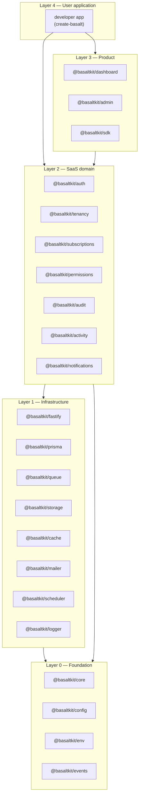
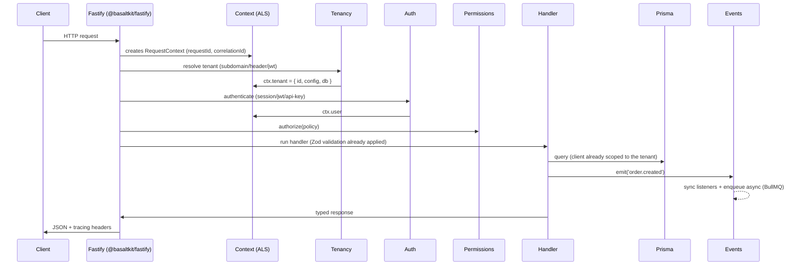
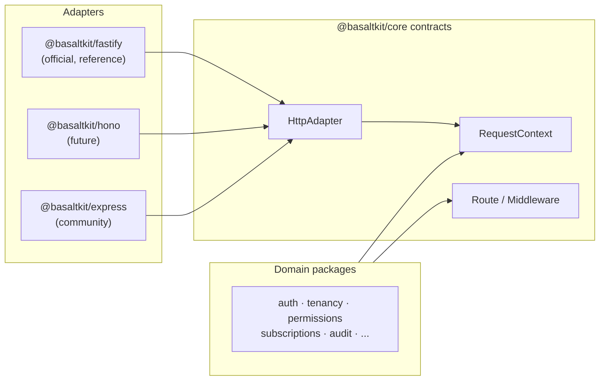

# RFC-0001 — Basalt: A SaaS Ecosystem for Node.js

| Field | Value |
|---|---|
| **Status** | Draft |
| **Author** | Basalt Core Team |
| **Created** | 2026-08-05 |
| **npm scope** | `@basaltkit/*` |
| **License** | MIT |
| **Stack** | Node.js 22+, TypeScript 5.x, Fastify 5, Prisma, PostgreSQL, Redis, MinIO, BullMQ, Zod, Vitest, TurboRepo, pnpm, Changesets |

> **Known technical debt:** deferred items that only surface with real backends (atomic billing, trial conversion at the gateway, durable webhook idempotency) are tracked in [KNOWN_LIMITATIONS.md](./KNOWN_LIMITATIONS.md), with a remediation plan and anchors in the code.

---

## 1. Vision and Philosophy

**Basalt** is an open source ecosystem of tightly integrated libraries for building SaaS applications in Node.js. The goal is not to create "yet another HTTP framework" — Fastify already solves that. The goal is to solve **the missing layer**: everything that sits between the HTTP server and a finished SaaS product — tenancy, billing, auth, permissions, auditing, queues, notifications — with the cohesion and elegance of a first-class backend toolkit.

### 1.1 Principles

1. **Convention over configuration** — a Basalt app works with zero config; everything is overridable.
2. **Fastify-first, not Fastify-locked** — the core is HTTP-agnostic; `@basaltkit/fastify` is the official adapter. This protects the ecosystem against the obsolescence of any single HTTP server.
3. **TypeScript as the design language** — end-to-end type inference (routes → Zod validation → handler → SDK client). No experimental decorators and no `reflect-metadata` as a mandatory dependency.
4. **Progressive disclosure** — a simple API for the common case, escape hatches for the advanced case. `auth.login(email, password)` works; underneath, every step is a replaceable hook.
5. **Tenancy as a first-class citizen** — unlike ecosystems where tenancy is a bolt-on third-party package, in Basalt the tenant context permeates cache, storage, queue, logger and Prisma natively via `AsyncLocalStorage`.
6. **Everything testable** — every package ships in-memory fakes/drivers (`@basaltkit/testing`), in the spirit of built-in test fakes.
7. **Documentation is product** — no feature ships without docs, a runnable example, and a cookbook recipe.

### 1.2 Anti-goals

- Do not reimplement the ORM (Prisma), HTTP server (Fastify), validation (Zod) or queue (BullMQ). Basalt **integrates and orchestrates**, it does not reinvent.
- Do not use decorators + `reflect-metadata` as the central DI mechanism (the structural mistake in NestJS that breaks with ESM/esbuild/Bun and hides the dependency graph).
- Do not couple to a specific frontend. The dashboard is optional and decoupled via the SDK.

---

## 2. Overall Architecture

### 2.1 Layers



**Dependency rule (architectural invariant):** a package may only depend on packages in **lower** layers. Packages in the same layer never import each other directly — they communicate through **events** and **contracts** defined in `@basaltkit/core`. This is enforced in CI with `dependency-cruiser`.

**Why:** this is what prevents the "big ball of mud". `subscriptions` does not import `tenancy`; it consumes the `TenantContext` interface exported by the core. Any domain package can be used in isolation inside an existing Fastify app — incremental adoption is the primary growth strategy (see §21).

### 2.2 Monorepo Structure

```
basalt/
├── packages/
│   ├── core/               # DI, plugins, lifecycle, context, hooks
│   ├── config/             # Typed configuration system
│   ├── env/                # Env var validation with Zod
│   ├── events/             # Event bus (sync/async/queued)
│   ├── logger/             # Structured logger (Pino-based)
│   ├── fastify/            # HTTP adapter + typed routing
│   ├── prisma/             # Prisma extensions (tenancy, audit, soft-delete)
│   ├── cache/              # Multi-driver cache with tags
│   ├── queue/              # BullMQ with a first-class developer experience
│   ├── jobs/               # Declarative job definition
│   ├── scheduler/          # Fluent cron
│   ├── storage/            # Object storage abstraction
│   ├── mailer/             # Templated email
│   ├── auth/               # Complete authentication
│   ├── tenancy/            # Multi-tenancy
│   ├── permissions/        # RBAC/ABAC
│   ├── subscriptions/      # Billing
│   ├── audit/              # Automatic audit trail
│   ├── activity/           # Activity log
│   ├── notifications/      # Multi-channel notifications
│   ├── cli/                # "basalt" CLI
│   ├── create-app/         # npx create-basalt
│   ├── generator/          # Code scaffolding
│   ├── testing/            # Fakes, helpers, factories
│   ├── sdk/                # Type-safe TypeScript client
│   ├── dashboard/          # Administrative dashboard
│   └── admin/              # Reusable admin components
├── apps/
│   ├── docs/               # Documentation site (basalt.dev)
│   ├── playground/         # Reference app used in E2E tests
│   └── examples/           # Official examples (starter kits)
├── tooling/
│   ├── tsconfig/           # Shared tsconfigs
│   ├── eslint-config/      # Shared lint rules
│   └── vitest-config/      # Test presets
├── .changeset/
├── turbo.json
├── pnpm-workspace.yaml
└── package.json
```

### 2.3 Package Conventions

Every package follows the same structural contract:

```
packages/<name>/
├── src/
│   ├── index.ts            # Public API — the ONLY exported entrypoint
│   ├── plugin.ts           # basaltPlugin() — integration with the core
│   ├── contracts/          # Public interfaces
│   ├── drivers/            # Replaceable implementations
│   ├── errors.ts           # Typed package errors
│   └── testing.ts          # Fakes (exported as subpath ./testing)
├── package.json            # exports map: ".", "./testing", "./plugin"
├── CHANGELOG.md            # generated by Changesets
└── README.md               # mirror of the package docs
```

- **ESM only**, `"type": "module"`, built with `tsup` (dual export only where there is real demand).
- **Strict `exports` map** — no deep imports; the public API is what lives in `index.ts`. This allows internal refactoring without a breaking change.
- Errors always extend `BasaltError` with a stable `code` (e.g. `TENANCY_NOT_RESOLVED`), documented — error codes are part of the semver contract.
- Every driver implements a `contracts/` interface and is registered in DI — swapping Redis for memory is a 1-line config change.

### 2.4 Publishing, Versioning and Maintenance

| Decision | Choice | Rationale |
|---|---|---|
| Versioning | **Fixed/locked** across core packages (all bump together, like Babel/Jest) | Eliminates the compatibility matrix; `@basaltkit/auth@1.4` always works with `@basaltkit/core@1.4`. Satellite packages (sdk, dashboard) can version independently. |
| Releases | Changesets + GitHub Actions; `latest`, `next` (pre-releases) and `canary` (every merge to main) channels | Fast community feedback without compromising stability |
| Semver | Strict. Breaking = major. Error codes, public events and config names are API | Trust is a framework's #1 asset |
| LTS | Each major, the previous one receives 12 months of security fixes | A requirement for enterprise adoption |
| Node support | The latest 2 active LTS lines | Balance between modernity and reach |
| Maintenance | CODEOWNERS per package; issues triaged with per-package labels; minimal-reproduction bot (StackBlitz template) | Scales the maintainer team horizontally |

### 2.5 Internal Request Flow



The central point: **`AsyncLocalStorage` carries the context** (request, tenant, user, correlation id) throughout the entire call stack — handlers, services, jobs, listeners — without passing parameters manually. It is equivalent to a per-request container, but native to Node.

---

## 3. `@basaltkit/core` — The Foundation

### 3.1 Responsibilities

| Subsystem | What it does |
|---|---|
| **DI Container** | Registration/resolution of services, scopes (singleton, request, transient), injection by typed token |
| **Plugin System** | The ecosystem's unit of composition; every package is a plugin |
| **Context (ALS)** | Typed and extensible `AsyncLocalStorage` |
| **Lifecycle** | Phases: `configuring → registering → booting → ready → shutting-down` |
| **Hooks** | Named extension points with priority |
| **Event Bus** | Re-export of `@basaltkit/events` wired into the container |
| **Discovery** | Auto-discovery of jobs, listeners, policies and commands by file convention |
| **Metadata** | Central registry of what each plugin declared (routes, jobs, schemas) — feeds the CLI, docs and dashboard |

### 3.2 Decision: DI without decorators

The container uses **typed tokens + factory functions**, not decorators:

```ts
import { createToken, type Container } from '@basaltkit/core'

// contract
export interface Mailer { send(msg: Message): Promise<void> }
export const MAILER = createToken<Mailer>('mailer')

// registration (inside a plugin)
container.singleton(MAILER, (c) => new SmtpMailer(c.get(CONFIG).mail))

// resolution — fully typed, no reflect-metadata
const mailer = container.get(MAILER)
```

**Why:** it works in any bundler/runtime (esbuild, Bun, Deno, edge), the dependency graph is explicit and navigable via "go to definition", and tree-shaking works. Legacy decorators + `emitDecoratorMetadata` is NestJS's biggest technical debt.

### 3.3 Plugin System

```ts
import { definePlugin } from '@basaltkit/core'

export const cachePlugin = definePlugin({
  name: 'basalt:cache',
  dependsOn: ['basalt:config'],
  configSchema: z.object({
    driver: z.enum(['redis', 'memory']).default('redis'),
    prefix: z.string().default('basalt'),
  }),
  register({ container, config }) {
    container.singleton(CACHE, () => createCacheDriver(config))
  },
  boot({ hooks }) {
    hooks.on('tenancy:switched', ({ tenant }) => { /* swap prefix */ })
  },
  shutdown({ container }) {
    return container.get(CACHE).disconnect()
  },
})
```

- `dependsOn` produces a topological boot ordering; cycles are an initialization error with a message explaining the cycle.
- `configSchema` (Zod) validates config at boot — **fail fast** with a message pointing to the wrong key.
- Hooks from other packages (like `tenancy:switched`) are typed via **module augmentation** — each package augments the global `BasaltHooks` interface.

### 3.4 Application and Context

```ts
import { createApp } from '@basaltkit/core'

const app = createApp({
  plugins: [configPlugin, prismaPlugin, tenancyPlugin, authPlugin],
})

await app.boot()

// Context — accessible at ANY point in the call stack
import { ctx } from '@basaltkit/core'

export async function anyService() {
  const { tenant, user, requestId, logger } = ctx()
  logger.info('processing') // already emitted with tenantId + requestId + traceId
}
```

`ctx()` outside an active scope throws `ContextUnavailableError` with a fix hint (run inside `app.runWithContext()`), except for fields with a safe fallback (logger).

### 3.5 Public API (summary)

```ts
export {
  createApp, definePlugin, createToken, ctx,
  type Container, type BasaltApp, type BasaltPlugin,
  type BasaltHooks, type RequestContext,
  BasaltError, onShutdown, onBoot,
}
```

**Core roadmap:** v1 — container, plugins, ALS, hooks; v1.x — discovery with watch mode, devtools for inspecting the DI graph; v2 — worker threads support with propagated context.

---
## 4. HTTP Layer — Framework-independent core

### 4.1 Architectural decision

Basalt **is not a library for Fastify** — it is an ecosystem with a core that is independent of the HTTP framework. The domain layer (auth, tenancy, subscriptions…) talks only to core contracts; the piece that translates HTTP ⇄ context is an **adapter**:



```ts
// @basaltkit/core/contracts/http.ts
export interface HttpAdapter {
  register(route: RouteDefinition): void
  use(mw: BasaltMiddleware): void
  listen(opts: ListenOptions): Promise<void>
  close(): Promise<void>
}

export interface BasaltRequest {           // neutral shape, not the Fastify Request
  method: string; url: string
  headers: Headers; params: Record<string, string>
  query: unknown; body: unknown
  raw: unknown                              // escape hatch to the native object
}
```

**Consequences:**
- Domain packages expose middlewares/guards as pure functions over `BasaltRequest` + `ctx()` — they never import Fastify.
- The Fastify adapter is the **reference implementation** and the only one guaranteed tier-1 support in v1. Other adapters follow a **conformance suite** published in `@basaltkit/testing/adapter-compliance` (the same model as a driver conformance test suite).
- This makes Basalt resilient to shifting fashions in the HTTP layer (Express → Fastify → Hono → whatever comes next) without rewriting the domain.

### 4.2 `@basaltkit/fastify` — Official adapter

**Goal:** end-to-end typed routing with Zod validation, leveraging Fastify's performance and plugin ecosystem.

```ts
import { route } from '@basaltkit/fastify'
import { z } from 'zod'

export const createProject = route({
  method: 'POST',
  url: '/projects',
  auth: true,                        // requires an authenticated user
  can: 'projects:create',            // permission (→ @basaltkit/permissions)
  body: z.object({ name: z.string().min(3) }),
  response: { 201: ProjectSchema },
  async handler({ body, reply }) {
    const project = await ctx().db.project.create({ data: body })
    return reply.code(201).send(project)
  },
})
```

- The `body`/`query`/`params`/`response` types are **inferred from Zod** — the handler is 100% typed and the same schema feeds OpenAPI (generated automatically) and the `@basaltkit/sdk`.
- `auth`, `can`, `tenant` are **declarative shorthands** that domain plugins register on the adapter via hooks — the adapter does not know about auth; it just runs the registered chain of guards.
- Discovery: files under `src/routes/**/*.ts` that export `route()` are registered automatically (convention; can be disabled).

**Dependencies:** `fastify`, `@basaltkit/core`, `zod`. **Roadmap:** v1 routes + OpenAPI; v1.x per-tenant rate limiting, ETags; v2 typed streaming/SSE.

## 5. `@basaltkit/prisma` — Data layer

**Goal:** make Prisma "speak Basalt": tenancy, auditing and conventions without changing the standard Prisma workflow.

- **Client extensions** (not a fork): `withTenancy()`, `withAudit()`, `withSoftDelete()` are official Prisma Client Extensions.
- The correct tenant client is accessed via `ctx().db` — resolved by the active tenancy mode (§6).
- **Connection pool management** for database-per-tenant: an LRU of clients with a configurable limit and idle disconnection (a real problem that is well solved elsewhere but rarely solved well in Node).
- Per-tenant migrations orchestrated by the CLI (`basalt tenant migrate`), with parallelism and per-tenant failure reporting.

```ts
// ctx().db is a PrismaClient already scoped to the current tenant
const users = await ctx().db.user.findMany() // WHERE tenant_id = ... automatic (shared mode)
```

**Dependencies:** `@prisma/client`, `@basaltkit/core`. **Roadmap:** v1 extensions + pool; v1.x read replicas; v2 sharding helpers.

---

## 6. `@basaltkit/tenancy` — Multi-tenancy

### 6.1 Isolation modes

| Mode | How it works | When to use |
|---|---|---|
| **Shared Database** | `tenantId` column + automatic filter via a Prisma extension | default; lowest operational cost |
| **Schema per Tenant** | `SET search_path` per request (PostgreSQL schemas) | medium isolation, a single database |
| **Database per Tenant** | A Prisma client per tenant with an LRU pool | maximum isolation, compliance |

The mode is config, not code: the app writes `ctx().db.user.findMany()` the same way in all three modes. Migrating from shared → database-per-tenant is a data migration, not a rewrite.

### 6.2 Resolvers

```ts
tenancyPlugin({
  mode: 'shared',
  resolvers: [
    subdomainResolver({ base: 'basalt.app' }),   // acme.basalt.app
    domainResolver(),                              // app.acme.com (custom domain)
    headerResolver({ header: 'x-tenant-id' }),
    jwtResolver({ claim: 'tid' }),
    routeResolver({ param: 'tenant' }),            // /t/:tenant/...
  ],
  // custom resolver = async function (req) => tenantId | null
})
```

Resolvers run in order; the first one to resolve wins. A resolution failure → `TENANCY_NOT_RESOLVED` (404 or fallback to the "central app", configurable — the same concept of central routes vs. tenant routes).

### 6.3 Context and automatic integrations

When the tenant is resolved, the plugin fires the `tenancy:switched` hook, and each infrastructure package adjusts itself:

| Package | Automatic effect |
|---|---|
| cache | `tenant:{id}:` prefix on all keys |
| storage | per-tenant root folder/bucket |
| queue | `tenantId` serialized in the job payload; restored in the worker via ALS |
| logger | `tenantId` field on every log |
| config | per-tenant overrides (`ctx().tenant.config.get('branding.logo')`) |
| mailer | per-tenant sender/branding |

```ts
// programmatic API
import { tenancy } from '@basaltkit/tenancy'

await tenancy.create({ id: 'acme', name: 'Acme Inc' })   // runs migrations + seed
await tenancy.run('acme', async () => { /* code in the tenant context */ })
await tenancy.forEach(async (t) => { /* bulk maintenance */ }, { concurrency: 5 })
```

**Events:** `tenant.created`, `tenant.deleted`, `tenant.migrated`, `tenant.switched`. **CLI:** `basalt tenant create|migrate|seed|run|list`. **Roadmap:** v1 shared + resolvers; v1.x schema-per-tenant, seeder; v2 database-per-tenant with an LRU pool, custom domains with TLS provisioning.

---

## 7. `@basaltkit/auth` — Authentication

**Goal:** complete server-side auth, with data in **your** database (Prisma), without vendor lock-in — positioned as a self-hosted alternative to Auth0/Clerk.

```ts
authPlugin({
  strategies: {
    session: { store: 'redis', ttl: '30d', rolling: true },
    jwt: { access: '15m', refresh: '30d', rotation: true },   // refresh rotation + reuse detection
    apiKey: { hash: 'sha256', prefix: 'mk_' },
  },
  mfa: { totp: true, recoveryCodes: 10 },
  oauth: {
    google: { clientId: env.GOOGLE_ID, clientSecret: env.GOOGLE_SECRET },
    github: { ... },   // providers via a driver interface — the community adds the rest
  },
  passwordReset: { ttl: '1h' },
  emailVerification: { required: true },
})
```

Ready-made flows (routes registered automatically, all overridable):
`POST /auth/register · /auth/login · /auth/logout · /auth/refresh · /auth/password/forgot · /auth/password/reset · /auth/verify-email · /auth/mfa/enroll · /auth/mfa/verify · GET /auth/oauth/:provider · /auth/oauth/:provider/callback`

- Passwords with **argon2id**; refresh tokens with **rotation + reuse detection** (revokes the whole family); API keys hashed with an identifiable prefix for secret scanning.
- Each step emits events (`auth.login`, `auth.login_failed`, `auth.mfa_enabled`…) — consumed by audit, notifications and rate limiting.
- Multi-tenant native: a user can be central (one login, N tenants) or per-tenant — a config decision, integrated with `@basaltkit/tenancy`.

**Roadmap:** v1 session + JWT + reset + verification; v1.x API keys, TOTP, OAuth (Google/GitHub); v2 WebAuthn/Passkeys, SSO SAML/OIDC (enterprise).

---

## 8. `@basaltkit/permissions` — Authorization

```ts
// role-based access control (RBAC)
await user.assignRole('admin')
await role.givePermissionTo('projects:delete')
await user.can('projects:delete')            // via role or direct permission

// Policies (ABAC) — for rules that need context
export const ProjectPolicy = definePolicy('project', {
  update: (user, project) => project.ownerId === user.id || user.can('projects:manage'),
  delete: (user, project) => user.hasRole('admin'),
})

// In the route handler (integrates with the `can` shorthand from §4.2)
can: 'project:update'        // resolves the policy with the loaded resource
```

- **Per-tenant scope**: roles/permissions belong to the current tenant by default; global roles are explicit (`{ scope: 'global' }`). This solves the #1 problem of doing role-based permissions in a multi-tenant SaaS.
- **Super Admin**: `superAdmin: (user) => user.isOwner` — short-circuits all checks via a before hook (a common authorization pattern).
- Permission cache in `@basaltkit/cache` with event-based invalidation (`permission.changed`) — checks are O(1) in memory per request.
- Guards per auth strategy: a permission can hold for a session but not for an API key (API key scopes).

**Roadmap:** v1 roles/permissions/policies + tenant scope; v1.x sync UI in the dashboard, wildcard permissions (`projects:*`); v2 temporary permissions and delegation.

---
## 9. `@basaltkit/subscriptions` — Billing

**Goal:** your own billing model in your database, with gateways as drivers — the app talks to Basalt, never directly to Stripe.

```ts
subscriptionsPlugin({
  gateway: stripeDriver({ secret: env.STRIPE_SECRET }),   // paddleDriver | lemonSqueezyDriver
  plans: definePlans({
    free:  { price: 0, features: { projects: 3, seats: 1, api: false } },
    pro:   { price: { monthly: 29, yearly: 290 }, trial: '14d',
             features: { projects: 50, seats: 10, api: true, 'api.requests': meter(100_000) } },
    scale: { price: 'custom', features: { projects: Infinity, seats: Infinity, api: true } },
  }),
})
```

```ts
// fluent API on the tenant (billable = tenant by default; configurable for user)
await tenant.subscribe('pro', { period: 'monthly' })
await tenant.subscription.swap('scale')                  // with proration
await tenant.subscription.cancel({ atPeriodEnd: true })

// Feature flags + limits — the heart of the feature-metering model
await tenant.features.can('api')                         // boolean flag
await tenant.features.remaining('projects')              // 47
await tenant.features.consume('api.requests', 1)         // metered; throws QuotaExceededError
```

- **Webhooks**: a single `/billing/webhook/:gateway` endpoint with signature verification, idempotency (dedupe by event id in Redis) and translation into **domain events** (`subscription.created`, `subscription.past_due`, `invoice.paid`) — the app never handles the raw gateway payload.
- **Eventual synchronization**: local state is the source of truth for reads (feature checks are O(1), with no gateway call); webhooks + a nightly reconcile job keep things consistent.
- Coupons, invoices (PDF via a job), grace period for failed payments, trial without a card.
- Middleware/guard: `subscribed('pro')`, `feature('api')` as route shorthands.

**Roadmap:** v1 Stripe + plans/trials/feature flags; v1.x metered billing, coupons, invoices; v2 Paddle + Lemon Squeezy, international tax/invoicing.

## 10. `@basaltkit/audit` + `@basaltkit/activity`

**Audit** (compliance — immutable, automatic):
- A Prisma extension records every CUD: who (`ctx().user`), in which tenant, what (before/after diff), when, and from where (ip/userAgent from the context).
- Subscribes to events from other packages: `auth.login/logout`, `permission.changed`, `subscription.*`, `tenant.*` — automatic coverage of the sensitive flows.
- Append-only: no update/delete API; retention and export (S3) are configurable.

**Activity** (product — a "so-and-so did X" feed):
```ts
await activity('project')
  .performedOn(project)
  .withProperties({ from: 'draft', to: 'published' })
  .log('published')

const feed = await activity.for(project).latest(20)
```
A deliberate distinction: audit is for the auditor (immutable, verbose), activity is for the end user (curated, readable). Combining the two in one log leads to conflicting retention and permission requirements; separating them avoids that.

## 11. `@basaltkit/notifications` — Multi-channel

```ts
export const InvoicePaid = defineNotification({
  name: 'invoice.paid',
  channels: (user) => ['mail', 'inApp', user.prefs.sms && 'sms'].filter(Boolean),
  via: {
    mail:  (n) => mailTemplate('invoice-paid', { invoice: n.invoice }),
    inApp: (n) => ({ title: 'Invoice paid', body: `Invoice #${n.invoice.number} confirmed` }),
    sms:   (n) => `Basalt: invoice #${n.invoice.number} paid.`,
  },
})

await notify(user, InvoicePaid, { invoice })
await notifyMany(tenant.admins(), InvoicePaid, { invoice })
```

- Channels as drivers: `mail` (via `@basaltkit/mailer`), `sms` (Twilio driver), `push` (FCM/APNs via web push), `whatsapp` (Cloud API driver), `inApp` (table + SSE/websocket for the dashboard).
- Sending is **always via the queue** by default (BullMQ retry/backoff); synchronous is opt-in.
- Per-user preferences (opt-out per channel/category) built in; versioned templates with a preview in the dashboard.

**Roadmap:** v1 mail + inApp; v1.x push + sms + preferences; v2 whatsapp, digest/batching ("5 new comments" in one email).

## 12. Infrastructure

### 12.1 `@basaltkit/storage`
```ts
await storage.disk('uploads').put('avatar.png', buffer)        // automatically tenant-prefixed
const url = await storage.disk('uploads').temporaryUrl('avatar.png', '15m')  // signed URL
await storage.disk('uploads').image('avatar.png').resize(256).webp().save('avatar-sm.webp')
```
Drivers: MinIO/S3 (same driver, S3-compatible), Local, Azure Blob, GCS — all passing the same conformance suite. Per-tenant isolation via prefix (default) or a dedicated bucket (config). Image processing via `sharp` in a job (does not block the request). Direct browser→storage upload with pre-signed URLs generated by the backend.

### 12.2 `@basaltkit/queue` + `@basaltkit/jobs`
```ts
export const SendWelcomeEmail = defineJob({
  name: 'email.welcome',
  schema: z.object({ userId: z.string() }),        // payload validated at dispatch AND in the worker
  attempts: 3, backoff: { type: 'exponential', delay: '30s' },
  async handle({ userId }) {
    const { db, logger } = ctx()                   // tenant restored automatically!
    ...
  },
})

await SendWelcomeEmail.dispatch({ userId }, { delay: '5m', priority: 2 })
```
BullMQ underneath; Basalt adds: typed/validated payload, **context propagation** (tenant/correlationId serialized and restored in the worker via ALS), a DLQ with replay from the dashboard/CLI, workers with graceful shutdown tied to the core lifecycle. `basalt queue work`, `basalt queue retry --failed`, `basalt queue stats`.

### 12.3 `@basaltkit/scheduler`
```ts
schedule.job(ReconcileBilling).daily().at('03:00').timezone('UTC')
schedule.command('tenant:cleanup').weekly().sundays()
schedule.call(() => cache.purgeExpired()).everyMinute().withoutOverlapping()
schedule.job(SendDigest).monthly().onFailure(notifyOps)
```
Implemented on top of BullMQ repeatable jobs (no daemon of its own — survives restarts, runs in a cluster without duplicating via a distributed lock). `withoutOverlapping()`, `onOneServer()`, a maintenance window, and `basalt schedule list` showing the next runs.

### 12.4 `@basaltkit/events`
```ts
export const OrderCreated = defineEvent('order.created', z.object({ orderId: z.string() }))

on(OrderCreated, async ({ orderId }) => { ... })                    // sync (same logical transaction)
on(OrderCreated, { queued: true }, async ({ orderId }) => { ... })  // becomes a job automatically
on('order.*', auditListener)                                         // wildcard
```
Typed events (Zod payload), sync or queued listeners (the events→queue bridge is automatic), wildcards for cross-cutting concerns (audit subscribes to `*`). **Domain events** (internal) vs **integration events** (publishable externally via the outbox pattern — v2, with a driver for the SaaS's own outgoing webhooks).

### 12.5 `@basaltkit/logger`
Built on **Pino** (the same family as Fastify, ~zero cost): JSON in production, pretty in dev, and **automatic enrichment via ALS** — every log carries `requestId`, `correlationId`, `tenantId`, `userId`, `traceId` (OpenTelemetry if present) without the developer passing anything. Redaction of sensitive fields (`password`, `token`) by default. Child loggers per module: `logger.child({ pkg: 'subscriptions' })`.

### 12.6 `@basaltkit/cache`
```ts
await cache.remember('plans', '1h', () => db.plan.findMany())     // cache-aside in 1 line
await cache.tags(['tenant', `user:${id}`]).put(key, value, '10m')
await cache.tags([`user:${id}`]).flush()
```
Redis and Memory drivers (same interface, same test suite); automatic per-tenant prefix; tags via sets in Redis; `remember` with **stampede protection** (distributed lock — only one process recomputes). Stale-while-revalidate in v1.x.

### 12.7 `@basaltkit/config` + `@basaltkit/env`
```ts
// env.ts — validated at boot, typed at use
export const env = defineEnv({
  DATABASE_URL: z.string().url(),
  REDIS_URL: z.string().url(),
  STRIPE_SECRET: z.string().startsWith('sk_').optional(),
})

// namespaced config, with per-environment and per-tenant overrides
config.get('mail.from')                       // typed via module augmentation
ctx().tenant.config.get('branding.color')     // tenant override (stored in the DB, cached)
```
Boot fails with an aggregated report of ALL invalid env vars at once (not one at a time). Secrets never appear in logs/errors (integrated with the logger's redaction).

### 12.8 `@basaltkit/mailer`
Drivers for SMTP, Resend, SES, Mailgun + a `log` driver (dev) and a `fake` driver (test). Templates with **React Email** (official) or MJML; per-tenant layout/branding; sending via the queue by default; a preview server in dev (`basalt mail preview`).

---
## 13. Tooling and DX

### 13.1 `@basaltkit/cli` — `basalt` (the ecosystem's command-line tool)

```
basalt dev                      # dev server with watch + pretty logs + embedded queue worker
basalt doctor                   # diagnoses env, connections, versions, pending migrations
basalt routes                   # lists routes with auth/permissions/schemas (via core Metadata)
basalt tenant create|migrate|seed|run|list
basalt queue work|stats|retry
basalt schedule list|run
basalt make controller|service|repository|use-case|event|listener|middleware|job|notification|mail|policy|command|test
basalt generate docs            # OpenAPI + route docs from the Metadata
basalt publish <package>        # copies a package's templates/config into the app
basalt upgrade                  # codemods between versions (jscodeshift) — key to painless majors
```

The CLI is **extensible via plugins**: any package (or the app itself) registers commands via `defineCommand()` in the core. `basalt doctor` and `basalt upgrade` are a direct investment in reducing churn — the two biggest causes of framework abandonment are a broken setup and painful majors.

### 13.2 `create-basalt`

```
npx create-basalt my-saas
┌ Database:       PostgreSQL (only one in v1 — no false choices)
├ Tenancy:        shared | schema | database | none
├ Auth:           session | jwt | both  (+ OAuth providers)
├ Payments:       stripe | paddle | lemon | none
├ Storage:        minio | s3 | local
├ Notifications:  mail | mail+inApp | full
├ Dashboard:      yes | no
└ Extras:         docker-compose (pg+redis+minio) | GitHub Actions CI | biome
```

Generates a project **working in a single command** (`pnpm dev` brings up app + docker-compose + migrations + seed), with a real domain example (a multi-tenant "Tasks" project with billing) — not a hello world. Each choice only adds the selected packages: what was not selected **does not exist** in the generated project (no commented-out dead code).

### 13.3 `@basaltkit/generator`

The scaffolding engine used by `basalt make *`. A `basalt make resource Project` generates the complete vertical: controller (typed routes), service, repository, use cases, Zod DTOs, policy, tests (unit + http) and OpenAPI schema — all following the app's templates (publishable via `basalt publish generator` for customization, like publishable stubs).

### 13.4 `@basaltkit/testing`

```ts
import { createTestApp, mailFake, queueFake, time } from '@basaltkit/testing'

const app = await createTestApp({ plugins: [...], tenant: 'acme' })

await app.actingAs(user).post('/projects', { name: 'X' }).expectStatus(201)
mailFake.assertSent(WelcomeEmail, (m) => m.to === user.email)
queueFake.assertDispatched(SendWelcomeEmail)
await time.travel('15d')                      // tests trial expiration
expect(await tenant.subscription.onTrial()).toBe(false)
```

Fakes for all drivers (mail, queue, storage, notifications, billing gateway), factories integrated with Prisma, an isolated test tenant per file (transaction with rollback), time travel. A ready Vitest preset (`@basaltkit/testing/vitest`).

### 13.5 `@basaltkit/sdk`

A TypeScript client **generated from the route Metadata** (not from an intermediate OpenAPI): `sdk.projects.create({ name })` with exact types from the server, errors typed by code, automatic auth (transparent refresh). This is what makes Basalt attractive for full-stack Next.js/React Native teams: a Basalt backend + any frontend.

### 13.6 `@basaltkit/dashboard` + `@basaltkit/admin`

- **admin**: headless components + UI (React, shadcn-based) for CRUD/tables/forms generated from Zod schemas — a built-in admin UI kit, embeddable in any React app.
- **dashboard**: a ready-made app built on top of `admin` + `sdk`: users, tenants, plans/subscriptions (MRR, churn), logs/audit, queues (DLQ retry), files, metrics, tenant impersonation. Mountable at `/admin` of the app itself or standalone. Everything protected by `@basaltkit/permissions`.

**Roadmap:** v1.x headless admin + basic dashboard (users/tenants/queues); v2 billing analytics, theme/white-label.

---

## 14. Documentation (basalt.dev)

A structure following the industry's recognized gold standard for framework docs:

1. **Getting Started** — installation, first app in 5 min, concepts (context, plugins, tenancy)
2. **Per-package guides** — narrative + runnable examples (not dry reference)
3. **Cookbook/Recipes** — "B2B SaaS with seats", "metered API billing", "custom per-tenant domain", "migrate Express → Basalt"
4. **Architecture** — this RFC distilled: ALS context, lifecycle, decisions
5. **API Reference** — generated from TSDoc (typedoc), separate from the guides
6. **Best Practices** and **Upgrade Guides** (with `basalt upgrade` codemods)

Every guide page has an "open in StackBlitz" button with a running example. Docs versioned per major. Search with Algolia DocSearch.

---

## 15. Roadmap — 3 years


| Phase | Deliverable | Exit criterion |
|---|---|---|
| **1 — MVP** (m1–5) | `create-basalt` generates a typed API with Prisma + CLI + Getting Started docs | 3 real apps built by early adopters; feedback incorporated |
| **2 — Core** (m6–9) | Complete infrastructure (queue, events, cache, storage, scheduler) | E2E playground covering all packages; 1k stars |
| **3 — Tenancy** (m10–12) | Multi-tenancy shared + schema, tenant CLI | "multi-tenant SaaS in 1h" showcase (video/article) |
| **4 — Auth** (m13–16) | Auth + permissions + audit | paid external security review |
| **5 — Subscriptions** (m17–20) | Stripe billing + notifications | 10 paying SaaS in production, documented |
| **6 — Dashboard** (m21–25) | **v1.0** — API freeze, dashboard, SDK | public semver promise; 100% docs; conference talk |
| **7 — Enterprise** (m26–36) | DB-per-tenant, SSO, LTS, more gateways | 1st public enterprise customer; active LTS program |

Cross-cutting rule: **no phase opens without the previous one's docs complete**. Late docs are blocking debt, not backlog.

---

## 16. Comparison

| | Basalt | Full-stack PHP framework | NestJS | AdonisJS | Plain Fastify | Supabase/Appwrite | Convex |
|---|---|---|---|---|---|---|---|
| Language/types | TS end-to-end, inference | PHP | TS + decorators/reflect | TS | TS (manual) | SDK client | TS |
| SaaS primitives (tenancy, billing, features) | **native** | via 3rd-party packages (billing ok) | none | none | none | partial (auth/storage) | none |
| Multi-tenancy | 1st-class, 3 modes | 3rd party | manual | manual | manual | ✗ | ✗ |
| Lock-in | zero (your DB, your deploy) | zero | zero | zero | zero | **high** (BaaS) | **high** |
| DI | typed tokens, no reflect | magic container | decorators (fragile in ESM/Bun) | own IoC | ✗ | — | — |
| DX/batteries | high | **very high** (reference) | medium (boilerplate) | high | low | high for CRUD | high for realtime |
| Basalt's position | — | inspiration; Basalt = "the batteries-included SaaS toolkit for Node" | we avoid its structural mistakes | closest competitor, but not SaaS-focused | Basalt builds on top | complementary/competitor: same problem, without lock-in | realtime niche |

**Positioning thesis:** AdonisJS is the generic full-featured backend framework for Node; Supabase solves SaaS with lock-in. The empty — and defensible — space is **"a batteries-included framework specifically for SaaS, self-hosted, without lock-in"**. Integrated tenancy + billing + permissions is the feature no competitor has and which alone justifies adoption.

---

## 17. Open Source Strategy

| Area | Decision |
|---|---|
| **License** | MIT across the board. Future monetization via cloud/services (a managed-hosting model), never via relicensing — a public commitment from day 1 |
| **Governance** | BDFL for the first 2 years (speed/coherence) → core team with per-package CODEOWNERS. Significant technical decisions via **public RFC** (repo `basalt/rfcs`, template inspired by Rust: motivation, design, drawbacks, alternatives, 10-day comment period) |
| **Contribution** | `CONTRIBUTING.md` + `good first issue` issues per package; a mandatory StackBlitz reproduction template on bugs; bounties on critical issues |
| **CI/CD** | GitHub Actions: lint (biome) + typecheck + per-package unit tests + E2E on the playground (matrix Node LTS × PG 15/16) + dependency-cruiser (layer rule §2.1) + driver conformance tests. Canary published on every merge |
| **Testing** | Minimum 90% coverage in core/auth/tenancy/subscriptions; public conformance suites for community drivers and adapters |
| **Release** | Changesets → automated release PR → npm publish with provenance; predictable monthly minor; major at most yearly, always with a `basalt upgrade` codemod |
| **Security** | `SECURITY.md`, private disclosure, advisories via GitHub; external audit before v1.0 (phase 4) |
| **Community** | Discord + GitHub Discussions; showcase of apps in production; monthly newsletter of narrated release notes |

### Adoption strategy

1. **Incremental adoption as a wedge**: each package works on its own in an existing Fastify app ("add `@basaltkit/tenancy` to your app today"). The full framework is the destination, not the toll at the gate.
2. **Content that demonstrates the thesis**: "multi-tenant SaaS with billing in 1 hour" (video + article + template) is the founding marketing material — the equivalent of the 15-minute Rails screencast.
3. **Initial target audience**: developers moving from other batteries-included backend frameworks to Node (they already understand the value), and TS teams tired of gluing together 15 libraries. Docs with a "coming from another framework: billing package → subscriptions, auth package → auth…" table.
4. **North-star metrics**: time to first deploy < 30 min; number of SaaS in production (not stars) as the real KPI.

---

## 18. Architectural decisions — record (ADR summary)

| # | Decision | Rejected alternative | Reason |
|---|---|---|---|
| 1 | HTTP-agnostic core + adapters | coupling to Fastify | longevity; Fastify is tier-1, not a prison |
| 2 | DI via typed tokens | decorators + reflect-metadata | ESM/Bun/edge-safe, explicit graph, tree-shaking |
| 3 | ALS as the context spine | passing `ctx` by parameter | ergonomic context propagation without real global state |
| 4 | Prisma extensions | own ORM / fork | do not reinvent; the Prisma ecosystem is an asset |
| 5 | Zod as the single schema source | manual JSON Schema | TS inference; feeds validation, OpenAPI and the SDK |
| 6 | Fixed versioning of the core | independent | eliminates the compatibility matrix |
| 7 | Local billing state + webhooks | call the gateway on every check | latency, resilience, multi-gateway |
| 8 | Scheduler on BullMQ repeatables | in-process node-cron | cluster-safe, survives restart |
| 9 | MIT + monetization via services | BSL/ELv2 | community trust is the moat |
| 10 | Audit ≠ Activity (separate packages) | a single package | different retention/permissions/audience |

---

*End of RFC-0001. Next documents: RFC-0002 (detailed Container/DI specification), RFC-0003 (tenancy protocol and connection pooling), RFC-0004 (adapter compliance suite specification).*
